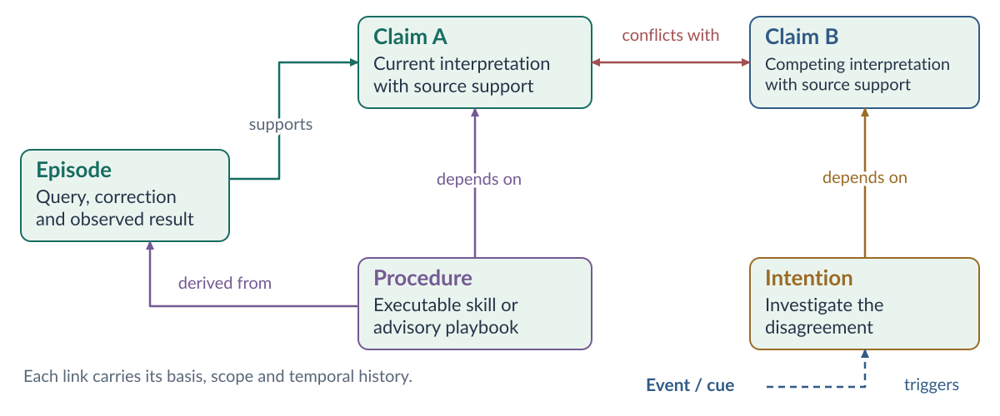
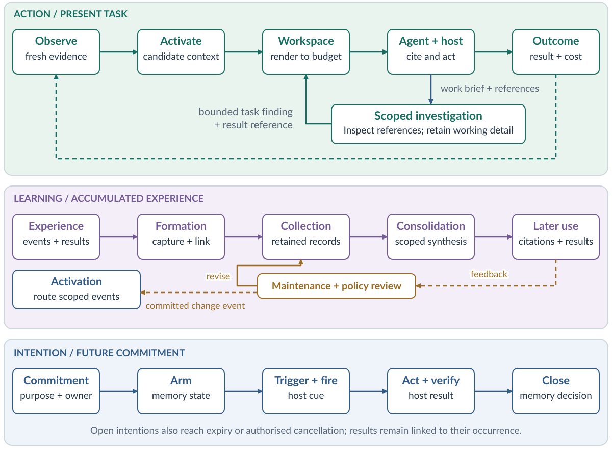
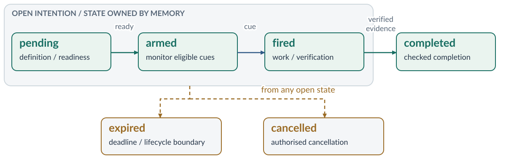
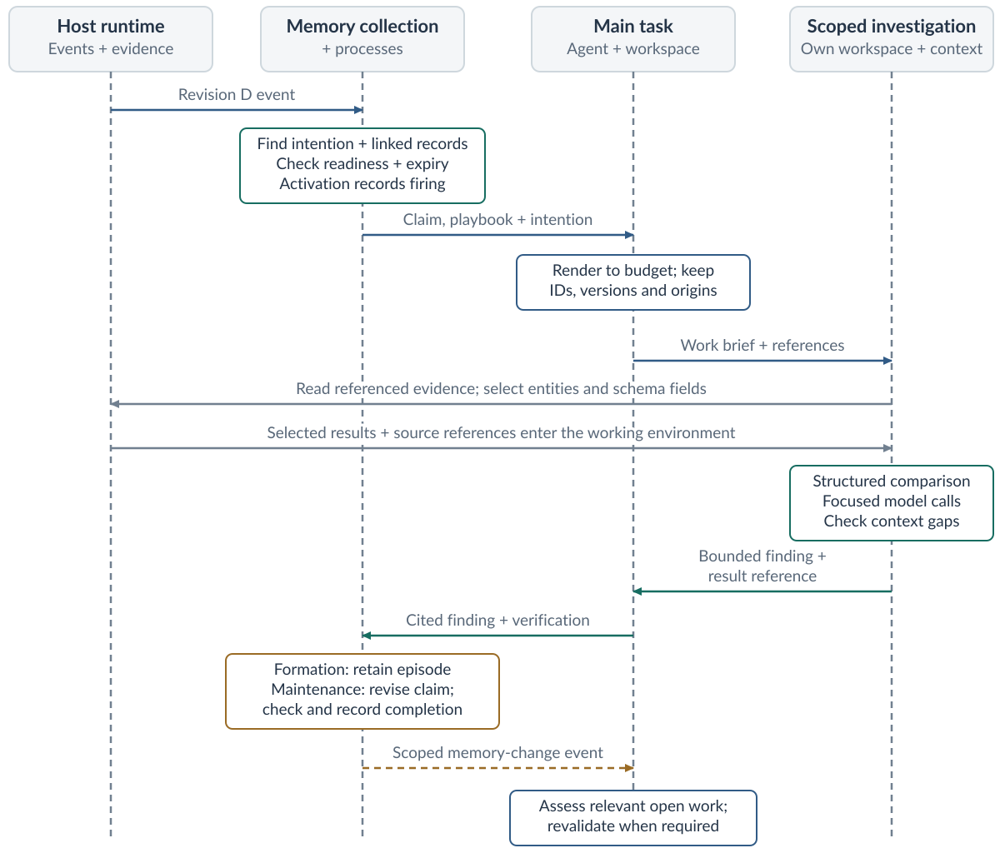
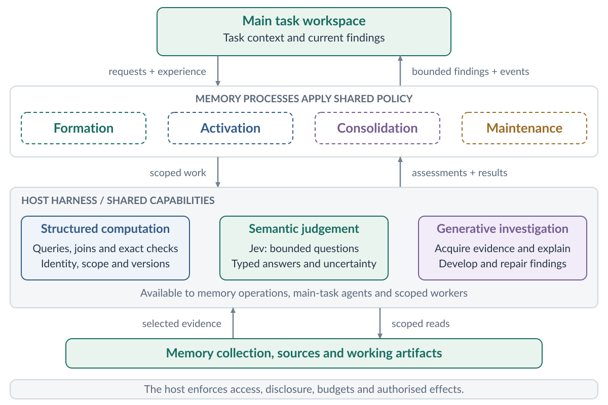
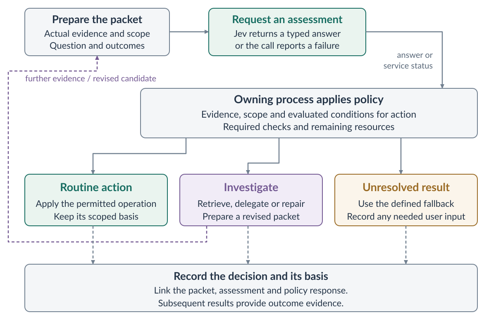

# Agent Memory

## System specification

**Draft | Conceptual design | 17 September 2026**

> Memory connects past experience, present attention and future action.

This specification describes how an agent can learn from past work and use that experience in later tasks. The memory system preserves useful experience, develops knowledge and methods, and brings relevant material into current work. It also keeps track of commitments so they can be acted on when the right opportunity arises.

The specification explains what each part of the system is responsible for, how the parts work together, and what evidence would show that they work as intended.

### The system at a glance

| Structure | Composition |
| --- | --- |
| Two logical stores | Workspace state for the main task and scoped operations, and the retained memory collection. |
| Four peer processes | Formation, activation, consolidation and maintenance. |
| Four retained-memory families | Episodes, knowledge, procedures and intentions. |
| Two shared concerns | Context and policy. |
| Three operating loops | Action, learning and intention. |

The main responsibilities are:

- **Workspace:** keeps track of a task or scoped operation and prepares the information its model sees, within the context limit.
- **Memory collection:** stores memories for later use and keeps the links between them.
- **Memory system:** decides what to retain, bring into use, develop or revise. It also tracks commitments, called *intentions*, through to their outcome.
- **Agent:** interprets information, makes decisions and requests actions.
- **Host:** runs the agent and its tools. It stores data durably, delivers events, enforces access and resource limits, and executes authorised actions.
- **Users and authorised operators:** set direction, contribute evidence and corrections, inspect findings, and control use within their authority.

### Reading map

| Pages | Focus |
| --- | --- |
| 2–9 | Composition, memory functions, bounded workspace and relationships |
| 10–21 | Processes, policy, feedback, operating loops, lifecycle and revision |
| 22–24 | Worked example and system behaviours |
| 25–30 | Process testing, evaluation and shared scenarios |
| 31–32 | Design rationale and primary references |
| 33–40 | Appendix A: semantic judgement, Jev integration and evaluation |

## 1. System composition

The memory system stores information in two places: the workspace for current work, and the memory collection for later use. Four processes work with that information: formation, activation, consolidation and maintenance. Each has its own responsibility, and none is treated as a subprocess of another.

All four use shared context to understand where a memory came from and when it applies. They also follow a shared policy that governs what to keep, what to bring to the agent's attention, what to develop further and what to revise.

Figure 1. Two logical stores and four peer processes. Users contribute through established input and policy paths. The harness inset shows workspace instances, shared capabilities and exchanged findings. Solid arrows carry information; dashed arrows show feedback or change events. The memory system owns policy.

### How the components cooperate

Useful experience enters the collection through formation. Consolidation can then compare related memories and develop broader knowledge or reusable methods, while keeping links to the material they came from. Maintenance checks whether memories remain supported, current and available for use.

When the agent has a task to do, activation finds relevant memories, ranks them and passes them to the workspace along with any relevant events. The workspace prepares the next context within the available budget and records which memory versions it includes.

The agent uses that context to reason and decide what to do, citing the memories it applies. The host carries out authorised actions and returns observations and results. These responsibilities can share one application.

### Scoped execution

The harness is the host's coordination layer for agent and memory work. It supports memory operations through scoped workspaces over referenced evidence and structured records. An operation can combine programmatic inspection, focused model calls and further decomposition where useful. Intermediate material stays in its working environment, while the calling task receives findings relevant to its next decision.

Scoped workspaces are instances of the workspace role. The four memory processes keep their existing responsibilities, and the host supplies the execution environment. This design draws on Recursive Language Models (RLMs), which place context in an external environment for programmatic inspection and recursive model calls, and on code execution with the Model Context Protocol (MCP), which processes tool results before returning selected material to a model. [12, 13]

The harness offers three ways to carry out this work. Structured computation applies explicit rules. Bounded semantic judgement answers specific questions about supplied material. Generative investigation gathers evidence and develops or revises findings. A process can combine them while retaining responsibility for its policy decisions. Appendix A describes the shared judgement capability, with Jev as the provider under consideration; Figure A1 shows where it fits.

## 2. Memory functions

Different kinds of memory contribute to work in different ways. Working memory lives in the workspace. Memories kept for later use belong to four families in the collection: episodes, knowledge, procedures and intentions. Each carries information about its sources and reliability.

| Function / location | Content | Contribution |
| --- | --- | --- |
| Working memory / workspace | Goal, constraints, observations, hypotheses, selected memory, plan and open work. | Integrates the information needed for the next decision. |
| Episodic memory / episodes | Situated events, circumstances, actions, corrections and observed outcomes. | Supplies concrete cases and the basis of previous decisions. |
| Semantic memory / knowledge | Claims, concepts, relationships, preferences and conventions, with scope and support. | Supplies retained understanding of the operating context. |
| Procedural memory / procedures | Executable skills or advisory playbooks, with applicability conditions and assessment criteria. | Supplies reusable ways to approach or perform work. |
| Prospective memory / intentions | Purpose, responsible owner, trigger, completion condition, expiry and memory-owned state. | Connects commitments to opportunities and verified follow-through. |
| Source and reliability / shared context | Origin, evidence, derivation, identity, scope, temporal history and validation. | Supports interpretation, selection, revision and explanation. |

### Two forms of procedural memory

An **executable skill** describes an operation the host can run. It states what must be in place before execution and which observable results establish success.

An **advisory playbook** guides investigation or judgement. It sets out suggested steps, decisions to consider and evidence to gather. Its checks assess whether the reasoning and supporting evidence meet the method's criteria.

Both forms state where and when they apply.

### User-scoped preferences

When a user states a preference directly, that statement is the authoritative source for their stated preference in that context and at that time. A preference stated for one project stays attached to that project; it does not automatically become a general preference.

A preference inferred from behaviour remains labelled as an inference. It is not treated as something the user has explicitly said. When the user changes a stated preference, the system updates the relevant record under the applicable policy.

### One experience, several useful representations

One investigation can produce several useful memories: an episode describing what happened, a claim that applies in that setting, a candidate method and an intention to follow up. Formation preserves each with its sources. Consolidation can later compare related material and develop more general knowledge or methods.

Shared context identifies the relevant user, project, task, entity and source revision. Source locators let the system return to the original material, such as a document passage, model entity, image region or structured field. Derivation links show when summaries or claims come from the same source. This prevents restatements from being counted as independent supporting observations.

Formation receives live observations, selected workspace material, trajectory segments and explicit contributions. These can contribute to different memory families according to their intended use, with origins and evidential status preserved. Activation brings the families' complementary contributions together in the workspace.

## 3. Workspace, budget and rendering

The workspace keeps track of the current task and prepares the context the agent sees before each decision. Because that context has a size limit, the workspace must choose what to include, account for the space used and preserve where each item came from. It also keeps enough task state to support handoff and restoration.

### Workspace lifetime

Working memory describes what information does. Temporary, session-local and persistent describe how long it is kept. The logical workspace includes scratchpads, intermediate findings and task-local artifacts. Each is kept for its task, session or recovery purpose. Material saved in a checkpoint still serves working memory.

Rendering selects the material needed for each decision. Formation separately selects useful contributions to retain in the memory collection.

### Exploration and selective transfer

A task or exploratory branch declares which existing context it may use and which new contributions may enter retained memory. These choices are independent. An exploration can use established knowledge while keeping its assumptions, intermediate findings and results task-local.

Selected findings or methods can subsequently be retained through formation or consolidation, with their hypothetical status, evidence and applicability preserved. Transfer to another project or shared scope follows access rules and carries the conditions needed to assess reuse.

Controls distinguish future memory use from the host's retention of artifacts, logs and recovery material. The applicable retention behaviour is available for inspection.

### Working material and rendered context

A logical workspace can hold structured query results, source references, scratchpads, intermediate comparisons and result artifacts. Large observations and tool results can enter this environment directly as referenced objects. Rendering gives the model an inventory, selected contents and a way to inspect further detail.

The main task and each scoped operation render their own bounded context. They exchange material through explicit references, selected evidence and returned findings. Each workspace follows its assigned task, operation and recovery lifetime.

For a semantic judgement, the harness prepares a packet containing the question, relevant source contents and the conditions needed to interpret them. References preserve origin; the contents provide the material to assess. The packet also identifies missing evidence and examined scope. Appendix A.3 defines this boundary.

### From candidates to a bounded context

Activation provides candidate memories with information about their relevance, applicability and support. It groups conflicting claims together and includes current change events. The workspace combines this material with fresh observations and the current task state, then selects what fits within the context budget supplied by the host.

The budget covers instructions, task information, tool descriptions, observations and memory. It must also leave room for the agent's response and expected tool results. Shared policy sets the priorities for using this space. The workspace records which memory items and versions it actually includes, so stored memories can be distinguished from those the agent had available in context. [6]

Rendering priorities protect governing constraints, the active goal, due obligations and uncertainty that could affect the decision. These priorities determine what to include and how much detail to provide. Where material appears in the prompt also takes account of stable context and cache reuse. Policy allocates the remaining space to evidence, knowledge and procedures. Compact summaries keep source references and links to fuller detail.

If the required context cannot fit, the workspace narrows the next step to an investigation that fits the budget and lists the material deferred for later.

### Cache-aware rendering

Rendering preserves stable context where useful and introduces observations, activated memories and corrections incrementally. Each correction identifies the earlier material it revises. At explicit task or budget boundaries, the workspace can compact or rebuild context when a clearer or smaller working set justifies the transition.

Rendering policy considers context capacity, expected reuse during the remaining workflow, cache costs, latency and decision quality. The host supplies information about the provider's cache capabilities and observed reuse. Every rendering choice must respect current access, retention and correctness requirements.

Scoped workspaces follow these same rendering principles. The main task receives bounded findings and relevant change events, while detailed processing stays in the operation's workspace. This allows useful stable task context to be preserved as external working material develops.

### Origin and lineage in the workspace

| Origin | Meaning and retained link |
| --- | --- |
| Observed | Arrived as a user message, source observation or host/tool result; retains its source locator. |
| Activated | Entered from retained memory; retains the memory identifier, version and activation context. |
| Agent-generated | Created during current reasoning or planning; retains cited inputs and its evidential status. |

Origin describes how an item entered the workspace. Evidential status describes what kind of information it contains: an observation, attributed statement, inference, assumption or simulation. These are separate properties. A generated summary records its own origin and keeps links to the items it summarises.

Results received from another operation identify the producing operation, how they were generated and their evidential status. A returned model interpretation remains an attributed inference linked to its supporting observations. Workspace origin records the route by which that result entered the receiving context.

A user can inspect the context selected for a task, including relevant observations, activated memories, working assumptions and outstanding obligations. The view identifies scope, source versions, evidential status and available supporting material. Recorded selections, declared applications and execution evidence establish what the system can show about its use of information.

Findings produced through scoped operations expose their question, examined scope, supporting references and unresolved work. The user can request further evidence or change how remembered material contributes to the current task.

### Preserving unresolved disagreements

When both sides of an unresolved conflict matter to the task, activation supplies them together with their supporting evidence and the linked investigation. The workspace keeps a concise account of both positions, where they apply and the fact that the disagreement remains open. Detailed evidence can be loaded as needed without losing sight of the disagreement.

### Continuity across context changes

When work is summarised, handed off or restored, it keeps its goals, constraints, source origins, cited memory versions and unresolved obligations. Resumed work assesses relevant changes against its declared scope and freshness requirements. The host applies current access and retention rules to restored material.

## 4. Connected memory and time

Each record and relationship keeps its supporting basis, the scope in which it applies and its history over time. A readable label and stable identifier make a memory easy to reference. The version identifies exactly which representation informed a decision.

Figure 2. Representative relationships. Evidence supports claims; a procedure depends on knowledge and derives from experience. Competing claims have a symmetric conflict link. An event triggers an intention to investigate.

| Relationship | Meaning |
| --- | --- |
| supports | An observation, episode or supported claim supplies a stated evidential basis for another claim. |
| challenges | Evidence or analysis questions a claim, its support or its scope. |
| conflicts with | Two claims assert incompatible positions in overlapping scope and valid time; the link is symmetric. |
| derived from | A representation records the specific inputs from which it was produced. |
| depends on | A claim, method or intention relies on another record or condition. |
| supersedes | A newer representation succeeds an earlier one for a stated scope and period. |
| triggers | An event or satisfied condition activates an eligible intention. |

### Inspectable records and evidence

Records and working artifacts expose descriptions of their structure, scope, size and available relationships. An operation can select, group, join and compare material before asking a model to interpret it. Entity identity, source revision, time, procedure, outcome and evidential links provide the basis for those operations.

An operation starts with a scoped view and can expand it through permitted source references and relationships. The surrounding events, supporting evidence and relevant counterexamples remain accessible as work is decomposed. Source locators allow inspection in the form the question needs, including text, structured fields and visual regions.

### Views over connected memory

Entity- and project-centred views assemble current claims, supporting experiences, applicable methods, open intentions and retained history. Each view identifies its scope, time basis and coverage of accessible records. Queries can follow relationships across these families and invoke scoped investigation where useful.

Views are generated from the underlying records and result artifacts. User contributions made through a view are applied through the responsible memory process, and subsequent views reflect the resulting state.

### Bitemporal history

The system records two kinds of time:

- **Valid time:** when a claim applies in the world.
- **Transaction time:** when a particular version was held as the system's recorded position.

A correction creates a new transaction-time version and states the valid-time interval it covers. Earlier recorded versions are preserved according to the retention policy. [8]

For example, a change may take effect on 10 September but only become known to the system on 12 September. Keeping these dates separate lets the system answer both “what applied on the 10th, using current knowledge?” and “what did the system have recorded on the 11th?” The time an observation was made is also kept with its source metadata.

Bitemporal history reconstructs the memory collection's recorded position under its retention policy. Reconstructing what an individual session had available uses that session's retained context selections, cited versions and use records. Collection history and session provenance have separate retention purposes.

## 5. Four peer processes

Each process has a distinct responsibility and follows the shared memory policy.

### Formation — preserve useful experience

- **Inputs:** observations, interactions, actions, results, selected workspace material, trajectory segments and explicit contributions.
- **Outputs:** records and local interpretations with a defined scope and links to their sources.

Formation selects material for a stated future purpose and organises it around meaningful events, such as a correction, decision or completed subtask. It keeps the circumstances, sequence and uncertainty needed to interpret what happened. When someone contributes a preference, expert method or commitment, the record preserves who supplied it.

### Activation — allocate present attention

- **Inputs:** task cues, host events, memory-change events, eligible records and current policy.
- **Outputs:** ranked groups of context for the workspace, including applicability conditions, relevant conflicts and due intentions.

Activation checks access and scope before retrieving candidate memories. It checks their current status and assembles material relevant to the decision. When an intention's trigger and readiness conditions are met, activation records that it has fired and sends the work to the responsible workspace. It also sends maintenance events to active tasks affected by a change.

Activation also supports entity-centred retrieval across episodes, knowledge, procedures and intentions. Shared identity, scope, time and relationships connect records about the same entity while keeping projects and revisions distinct. A retrieval can bring together the entity's relevant claims, supporting experiences, applicable methods and outstanding obligations.

### Consolidation — develop abstractions and methods

- **Inputs:** related episodes, existing knowledge and procedures, outcomes from cited use, and explicit requests for synthesis.
- **Outputs:** linked summaries, abstractions, candidate procedures and proposals to extend where existing knowledge or methods apply.

Consolidation compares cases to find recurring patterns, combine compatible findings and propose reusable methods. Each output explains where it came from, its evidential status and where it is proposed to apply. Links to supporting cases and counterexamples remain available. Tests and later applications provide evidence for broader reuse. [2]

Consolidation can begin when a group of tasks finishes, a pattern recurs or a scheduled synthesis is due. Policy gives it a separate budget and criteria for checking whether its outputs preserve the source meaning and justify broader use.

### Maintenance — keep retained memory current

- **Inputs:** current evidence, record dependencies, feedback from memory use, lifecycle events and retention policy.
- **Outputs:** updates to support, validity, relationships, priority, availability and intention state, with events describing those changes.

Maintenance incorporates corrections and records when claims conflict or one record supersedes another. It reassesses dependent records and manages retirement and deletion. It also verifies intention completion and records expiry or cancellation.

Source changes, missing support, deadlines, retention requests and scheduled reviews can all trigger maintenance. Its budget and review criteria focus on keeping memories current and retaining them appropriately.

### Learning from user contributions

Users can identify a useful investigation, demonstrate a method, explain a correction or supply a counterexample as input to learning. Formation preserves the contribution and its context. Consolidation develops the reusable method, identifies its applicability conditions and examines related evidence.

The system assesses and reuses the resulting method under the existing evaluation and memory policy. Its retained representation distinguishes the original demonstration, additional support, tested conditions and observed applications. Users can inspect representative cases and refine the conditions that matter.

Consolidation can also develop a reusable recognition criterion from a useful task-local check. It retains the question, required inputs, applicability and supporting cases alongside the method. Evaluation determines where the check may guide future operations; Appendix A.5 describes this transition.

### Execution across the four processes

Each process chooses an execution strategy suited to its question. Direct queries and rules handle explicit structure. Bounded judgements assess supplied evidence, while generative workers develop findings or investigate unresolved questions. Further decomposition supports work that spans several cases or dependencies.

| Process | Typical scoped work |
| --- | --- |
| Formation | Inspect bounded events and referenced artifacts. Preserve useful episodes and local interpretations with their context. |
| Activation | Retrieve connected records, investigate applicability where needed, and assemble a supported working set. |
| Consolidation | Compare related cases and exceptions. Develop linked abstractions and conditional methods. |
| Maintenance | Combine explicit lifecycle rules with investigations of support, disagreement, validity and changed conditions. |

### Semantic assessments

A process can use a bounded judgement when a particular interpretation controls its next step. Activation, for example, can check whether the supplied observations establish a method's prerequisites. The answer can support selection or identify a condition that needs investigation. The other processes can use the same capability to assess claims, abstractions and changes. Workers can also check handoffs and summaries against their sources. Appendix A.2 explains these uses and the process responsible for each response.

### The scoped operation

Each operation receives a work brief that defines:

- **Purpose:** the question to answer and the decision or memory process it supports.
- **Frame:** relevant constraints, definitions, entity scope, source versions and time assumptions.
- **Evidence access:** starting records, source locators, known conflicts and permitted routes to further evidence.
- **Resources:** the allowance for elapsed time, model use, computation and returned material.
- **Expected result:** the finding or proposed change, its basis, applicable conditions and remaining uncertainty.

The operation can request more context within its permissions when a dependency or ambiguity needs investigation. Decomposition must preserve the conditions needed to interpret each subproblem. The coordinating operation tracks what has been examined, outstanding dependencies and coverage of the original question. When it combines results, it preserves relevant disagreements, exceptions and partial findings.

### Results and integration

A substantive operation produces an inspectable result artifact. It contains the findings, supporting references, input versions, applicability, coverage and unresolved questions. The operation returns a bounded message with what its caller needs, important qualifications and a reference to the artifact. The caller can inspect the supporting detail or request further work.

Working results follow their workspace retention policy. Useful contributions enter the collection through the responsible memory process and its existing checks. Committed changes produce the scoped events used for activation and reconciliation.

Tests examine each process's inputs, outputs, preserved state and permitted effects under controlled state, evidence and policy. Section 12 defines the shared fixtures, assertions and evaluations of later usefulness.

## 6. Shared policy and observable use

### Policy has an owner

The **memory system owns operational memory-policy decisions**. It decides what to retain, bring into use, develop further, review or retire. All four processes apply the same versioned policy. The operator configures goals, scopes, retention rules and budgets. The host enforces access and resource limits and ensures that actions are authorised.

The agent contributes task goals, interpretations, proposals about what is worth remembering, and evidence from applying memories. The memory system considers these proposals under its policy. Each decision records the policy version and a brief reason, so the basis for keeping or using a memory can be inspected.

The memory system sets the purpose and policy conditions of memory work. The harness coordinates execution, including decomposition and result assembly. Models propose inspection and reasoning strategies. Across every scoped workspace, the host enforces permitted operations, access, isolation, resource limits and authorised effects.

### Autonomous operation and user direction

Routine formation, activation, consolidation and maintenance proceed autonomously under established policy. Users can inspect relevant context, contribute evidence, correct interpretations, refine scope, teach methods and establish commitments. These interactions enter the same records, processes and event paths as autonomous work.

Personal preferences, shared conventions and operational policies follow their respective authority rules. A user contribution records its origin, intended scope and meaning. The system distinguishes a preference, an assertion about the world, a task instruction and an authorised policy change, applying each through the appropriate process.

### Communication and requests for user input

The system makes meaningful changes in understanding available through task views and on-demand or policy-scheduled change briefs. Briefs distinguish established findings, candidate lessons and unresolved questions, with their evidence and consequences for relevant work. Related updates are grouped according to scope and user communication preferences.

A request for user input is raised when progress requires user intent, unavailable evidence or authorisation specified by policy. The system first completes useful investigation within its authority, then presents the precise question, relevant evidence, affected work and the consequence of deferral.

Outstanding requests have an owner, an expiry or review horizon, and a defined fallback. Independent work continues where permitted. Affected actions follow the fallback while the answer remains unresolved; actions requiring authorisation remain held. Silence does not establish approval. A response is recorded with its scope and authority and applied through the responsible process.

### Starting policy

The starting policy uses explicit rules:

- Respect the scope and access rules that apply to each memory.
- Preserve active obligations and uncertainty that could affect the current decision.
- Select memories according to task relevance, applicability, support, freshness and configured priority.
- Schedule consolidation and maintenance within their allocated budgets.

Every priority change must be traceable to a rule, an authorised configuration change or reviewed evidence.

### Policy for bounded judgements

An established judgement family defines its question, input requirements, possible outcomes and permitted uses. Its policy determines when an assessment is sufficient for an operation and when further work is needed. These conditions are evaluated for the relevant domain and action.

Missing evidence, an ambiguous assessment and a service failure require different responses. Policy can obtain evidence, request a scoped investigation or preserve an unresolved result. It can also complete a routine permitted operation when the required conditions hold. Uncertainty alone does not create a need for user input. Appendix A.4 and Figure A2 describe the response paths.

### Operation budgets

Each operation has one aggregate allowance covering packet preparation, coordinating and judgement calls, child work, retries, local computation and result assembly. Policy limits elapsed time, model use, concurrency, decomposition depth and returned material. It also reserves capacity for assembling a useful result.

The initial strategy favours direct inspection and shallow semantic processing. Choices include reusing an existing result, performing a structured query, requesting a focused interpretation or launching a deeper investigation. Further decomposition is selected when the problem structure warrants it. When an operation reaches its stopping condition, it returns its findings, the scope examined and the work still outstanding. If the question remains incomplete, the result is labelled as partial.

Independent questions can share one packet when they use the same evidence and disclosure permissions. A question that depends on a prior answer or newly acquired evidence uses a subsequent packet. Checks are selected for meaningful candidates, results and changes within the operation's allowance.

### Reuse of completed work

A completed result can be reused when its purpose, input versions, scope, method and applicability match the new request. Reuse checks current access, retention and required freshness. Temporary results remain workspace artifacts. Contributions selected for longer-term reuse enter the appropriate memory family.

Reusing a semantic assessment also requires matching source contents, question definition and model identity. A policy change can reconsider the recorded answer; materially changed evidence requires a new assessment. Evaluation distinguishes reuse of an assessment, a completed investigation and cached model input, and measures their contribution to total workflow cost.

### Available, selected and applied

| Stage | Observable record |
| --- | --- |
| Available | Activation’s eligible candidate set for a particular task decision. |
| Selected | Memory identifiers and versions actually included in the rendered agent context, plus rendering cost. |
| Applied | Explicit references from the agent’s decision, action or output to the memories used, with their role and task context. |

The agent cites the stable identifier and version of each memory it uses. It also states the memory's role: evidence, a method, a constraint or a prior interpretation. These citations record **declared application**. When the agent uses an executable skill, the host also records whether it ran and what result it produced.

Formation uses cited inputs to create **derived from** links for new claims, summaries and methods. A use record shows which memories an action or decision declared as inputs. A derivation link shows which inputs produced a new retained record. Citing a source does not automatically make it supporting evidence; the system records the role it actually plays.

Available, selected and applied are recorded within the workspace and operation where they occur. Programmatic processing records its input references and transformations. Model processing records the material rendered into that call and its declared applications. An inventory or reference is recorded separately from the underlying content inspected.

A parent task cites the returned finding it uses. That finding links to its producing operation and supporting inputs, distinguishing evidence the parent inspected from evidence assessed through delegated work. Derivation across operations preserves the original sources and their independence.

Judgement records preserve the supplied evidence and coverage, question definition, model identity and typed answer. The process records its policy decision separately from that answer. A generated explanation remains an attributed inference, and repeated assessments of the same material retain their common source. Appendix A.5 defines the recording responsibilities.

Feedback connects memory use to observed outcomes and latency. It also records the costs of formation, activation, rendering, consolidation, maintenance and repair. Targeted comparisons test whether memory use improves results and provide evidence for policy changes. Citation coverage and execution evidence are measured separately.

Feedback reports both per-operation costs and the aggregate workflow cost. This includes coordinating calls, child calls, local computation, rendering and repeated work.

Rendering feedback distinguishes cached reads, uncached processing, cache writes where applicable, and the cost of summarising or rebuilding context. Comparisons assess total workflow cost at comparable outcome quality. They include both the initial cost of changing context and any savings from its later reuse.

## 7. Three interacting loops

The same components support three kinds of activity: doing the current task, learning from experience and following through on commitments. Each loop produces observations or results that can inform the others.

Figure 3. A scoped investigation returns a task finding. Consolidation compares retained cases through scoped work, and committed changes reach tasks through activation. The intention loop keeps firing and checked completion in memory.

### Action

New observations and activated memories update the task state. The workspace prepares context within its budget, and the agent uses it to decide what to do, citing the memories it applies. The host then executes authorised actions and returns results. Those results become new experience for the system.

### Learning

Formation captures episodes and findings from individual tasks. Consolidation uses related material to develop broader knowledge and methods. When these memories are applied later, the resulting feedback helps maintenance reassess their support and availability. Policy review considers whether selection rules should change. Activation makes new and revised records available to future work.

### Intention

A commitment is stored as an intention. Once its definition is complete and it is ready to act on, maintenance arms it. A matching event causes activation to record that it has fired and route the work. Results and verification evidence return to memory, where maintenance checks whether the intention is complete or has reached another terminal state.

### Context and timing

Scoped execution can occur on the current task's critical path, alongside independent work or after task completion. Scheduling follows decision relevance, urgency and cost. Task requests and host-delivered events can initiate the same operation.

A result relevant to a decision enters the receiving workspace through bounded rendering. Committed memory changes follow the scoped event and reconciliation rules. Routine operations follow their task or job lifecycle. Deferred obligations use prospective memory and its intention lifecycle.

> Memory influences what the agent attends to and does. Those actions shape the experience available for future memory formation, consolidation and review.

## 8. Intention lifecycle and ownership

The memory system owns the intention record and tracks its state. The responsible owner is the person or agent assigned to carry out the work. The host manages execution jobs and reports scheduling, results, time and cancellation events. Memory uses those events to assess whether the intention's conditions have been met.

Formation creates a pending intention with the policy's default expiry. Maintenance arms it when it is ready. Activation records when it fires, and maintenance records its terminal outcome after checking the relevant conditions.

Figure 4. Intention state in memory. Completion follows checked evidence. Expiry and cancellation are available from every non-terminal state; their arrows originate from the shared non-terminal group.

| State | Meaning and transition basis |
| --- | --- |
| pending | Purpose is retained; definition or readiness is being established. |
| armed | Owner, trigger, completion condition and expiry are defined; readiness holds and events are monitored. |
| fired | An eligible trigger occurrence has been recorded and routed for action; work or verification is outstanding. |
| completed | Maintenance has checked evidence satisfying the completion condition and recorded it. |
| expired | The expiry condition has been reached while the intention remained open. |
| cancelled | An authorised cancellation has been recorded, with its reason. |

### User-visible commitments

A user-visible commitment presents its purpose, scope, responsible owner, trigger, completion condition, expiry and current status. Users with the relevant authority can amend, renew or cancel it. Changes are applied through the memory-owned lifecycle and reflected in host execution where required.

Communication preferences specify which events merit notification, such as a material finding, an unresolved blocker or verified completion. These preferences govern delivery while the commitment's state and evidence remain inspectable.

Completion reports identify the observed result and its basis. Expired or cancelled commitments retain their recorded outcome, including what happened to outstanding execution when applicable.

### Triggers, results and completion

Each trigger occurrence is linked to its intention and current state. If the same trigger is delivered again, it refers to the existing occurrence. Execution attempts and retries stay attached to that fired occurrence, with host status providing evidence about what happened.

Memory declares completion only after the required result checks. These include confirmation from the owner or reviewer when the completion condition requires it.

### Expiry and terminal outcomes

Every intention has a finite expiry condition, such as a deadline or a defined endpoint in the task lifecycle. Longer-lived commitments have an explicit date or boundary for review and renewal. An intention can expire or be cancelled while it is pending, armed or fired. The host receives any resulting stop request and reports what happened to work already in progress.

Results that arrive after an intention has reached a terminal state remain attached to the original occurrence and that state. Further work gets a linked follow-up intention. For recurring commitments, the system keeps the recurrence rule and tracks each occurrence separately through the lifecycle.

## 9. Revision, support and active work

### Three independent assessments

| Assessment | Question | Basis |
| --- | --- | --- |
| Reliability | What supports this memory? | Origin, evidence, uncertainty, independent corroboration and validation. |
| Applicability | Where and when can it guide this task? | Scope, preconditions, source version, capabilities and current conditions. |
| Utility | What value does it provide in use? | Declared applications, observed outcomes, costs and comparative tests. |

### Revision reaches the workspace as an event

When maintenance commits a change, it publishes a memory-change event. The event identifies the affected records, their previous and current versions, the reason for the change, and the relevant scope and valid time. Activation makes relevant events available to active workspaces. Each workspace reconciles changes at an explicit point and preserves which versions informed its earlier decisions.

An active task revalidates a working conclusion when a substantive change affects its supporting evidence, meaning or applicability within the scope of unfinished work. It checks whether the conclusion remains supported, needs qualification or requires correction. Freshness checks follow the task's declared requirements. The host checks current permissions and operating conditions at execution.

Completed results keep their recorded evidence, scope and verification history. Retrospective review follows an explicit request, a retained review obligation or an applicable review policy.

### Task-local dependencies

The workspace can track active dependencies through references to the memory versions supporting open conclusions and intended actions. These references follow the workspace lifecycle. Checks during retrieval, resumption and relevant task boundaries support reconciliation, while scoped events can give earlier notice of a change.

Historical session provenance is kept according to its purpose and policy. Any obligation to continue reviewing earlier work is recorded explicitly.

### User-supplied corrections

A correction identifies the affected finding or memory, the proposed distinction and its intended scope. The system establishes whether it concerns the current task, a retained claim, a personal preference, a shared convention or an operating policy. Material ambiguity about scope or authority is resolved before the corresponding shared change is applied.

Accepted changes make their effect inspectable: what changed, where it applies, what evidence supports it and which unfinished work requires attention. Completed results retain their recorded scope and verification history under the retrospective-review policy.

An authorised reversal updates the retained representation and its applicable period. External actions follow the host's separate cancellation or recovery rules.

### Results from scoped work

Each result identifies the input versions and task scope it examined. Before applying it to unfinished work, the receiving process checks for substantive intervening changes against that scope and the task's freshness requirements. It can use the result, qualify it or request a targeted update. References local to an operation follow their retention purpose. Completed outputs preserve the basis under which they were verified.

### Disagreement and historical succession

When incompatible claims overlap in scope and valid time, maintenance connects them with **conflicts with**. It keeps their supporting evidence and links an intention to investigate. Activation presents both relevant positions and makes clear that the disagreement is unresolved.

Candidate conflicts can be detected during capture, activation or later review. Investigation is scheduled according to decision relevance, urgency and cost. A conflict that affects the next action receives a bounded investigation within the task. Independent questions or those that concern future work can be investigated separately or during post-processing.

Maintenance manages the conflict record and committed resolution, agents gather evidence, and the host schedules the work. Deferred investigations keep their supporting claims and open status. Once an investigation is resolved, the system records the evidence and resulting interpretation.

Semantic assessment can also identify possible indirect dependencies among records selected through scoped search. Those findings supplement explicit links and follow the same rules for evidence, required checks and reconciliation with unfinished work. Appendix A.6 follows this through a source-revision example.

When a newer record supersedes an earlier one, the system states the scope and valid-time interval in which the successor applies. Transaction history preserves what the system had recorded before the update.

### Deletion and support reassessment

A deletion instruction states what content must be removed and where the instruction applies. The host coordinates removal from retained records, derived summaries, indexes, caches and restored workspace material within that scope. Maintenance follows both derivation and support links and publishes the resulting change events.

Two cases require different treatment:

- **Content covered by the deletion instruction:** the same removal rule applies to dependent records that contain or reconstruct it.
- **A claim that may be retained separately, but whose supporting episode is removed:** maintenance reassesses the remaining independent support. The claim stays available if that support meets policy. Otherwise, it is retired from current guidance and linked to a revalidation intention where that work remains useful.

Where policy permits, a minimal “support removed” marker can record that reassessment took place. The marker, historical versions, provenance and regenerated records must all respect the deletion scope. Active and restored workspaces apply the removal during reconciliation. The host applies current access restrictions immediately.

## 10. Worked example: a source revision

Consider a model investigation. It establishes that revision C stores a property on the element type. Formation keeps an episode describing the investigation and a claim scoped to that revision. The inspection method becomes a candidate playbook.

An armed intention calls for a recheck when the next revision arrives. It names the responsible owner, defines the evidence needed for completion and sets an expiry horizon.

### Scoped investigation

Activation assembles the relevant revision-C finding, playbook, supporting episodes and exceptions. A scoped investigation receives the revision-D objective, verification requirements and access to the current model. Structured inspection selects relevant entities and schema fields. Focused model calls interpret ambiguous material where needed.

Query results and intermediate comparisons remain in the investigation workspace. The task receives the mapping finding, supporting references, coverage and unresolved questions. Formation preserves the useful experience. A separately scheduled consolidation operation can compare it with earlier cases and refine the playbook.

Figure 5. Revision D triggers a scoped recheck. Selected evidence stays in the investigation workspace; a bounded finding returns to the main task. Memory records completion only after checking the evidence.

### What the sequence establishes

During the recheck, the agent cites the relevant claim and playbook versions. Its observation of revision D becomes a new episode. Maintenance records the updated claim with both valid time and transaction time, while preserving where the revision-C claim applied. It completes the intention after the defined checks.

The change event is available to active workspaces whose open work depends on the affected finding. Each task assesses its relevance against the task's scope and required source revision. Completed results about revision C keep their recorded applicability and verification history. A later consolidation pass can compare the C and D episodes to refine the playbook's conditions, with its own derivation links and review.

If a result arrives after expiry, it is attached to the expired occurrence. Renewed work requires an explicit follow-up commitment. If current sources disagree, the system keeps both claims and a linked investigation, and activation presents them together.

## 11. System behaviours and review criteria

The stores, processes and shared policy are intended to produce the behaviours below. Each can be assessed by observing how the components work together and what happens in the task.

| Behaviour | Component relationship | Evidence to seek |
| --- | --- | --- |
| Continuity | Workspace reconstruction uses task state, knowledge within the task's scope and open intentions. | After interruption, work resumes with its goal, constraints, origins and unresolved questions intact. Relevant changes are assessed against declared freshness requirements, within the rendering budget. |
| Accumulating expertise | Consolidation develops knowledge and methods from episodes; application and maintenance assess reuse. | A retained method helps on a later related task, with supporting cases, derivation and applicability visible. |
| Context-sensitive transfer | Activation matches procedure form, conditions and scope to the current task. | Similar cases retain distinct identity; adapted executable skills and advisory playbooks are assessed against their respective criteria. |
| Evidence-driven correction | Scoped change events and task-local references identify substantive changes affecting unfinished work. | A relevant correction prompts targeted revalidation. Results keep their recorded scope and verification history. Retrospective review follows an explicit request, retained obligation or applicable policy. |
| Proactive follow-through | Host events trigger memory-owned intention transitions and route work to its owner. | Eligible cues produce one recorded occurrence. Fulfilled work completes with evidence; unmet or withdrawn commitments expire or cancel with reasons. |
| Adaptive attention | Cited-use feedback and comparative evaluation inform reviewed policy changes. | A revised selection policy improves task outcomes or lowers cost at comparable outcome quality, with matched evaluation conditions. |
| Focused investigation | Scoped workspaces inspect referenced material and return supported findings to the main task. | The task reaches an adequately supported result while detailed processing remains inspectable outside its main rendered context. Total cost and evidence coverage are recorded. |
| Effective user influence | Inspectable context and scoped contributions connect users to autonomous memory processes. | A user can understand a finding's basis and make a correction or contribution that changes subsequent work in the intended scope, while routine operations continue under policy. |

### Review operations and outcomes together

Checks of individual operations examine whether the system captures information faithfully and preserves its sources and scope. They also test time semantics, conflict handling, context rendering, applicability, intention transitions, deletion effects and citation coverage. Comparisons across whole tasks assess decision quality and total cost.

Section 12 defines the unit-test boundaries, semantic evaluations and controlled task comparisons used to assess these behaviours.

Comparisons use matched tasks, models and resource limits. They document differences in the history, curated memory and retained material available to each system. Results report quality, missed obligations, use of outdated memories, unnecessary work and the cost of every memory process. Policy experiments retain the policy version and selection history so their results can be interpreted.

## 12. Process testing and evaluation

### Test structure and levels

A test fixture is a prepared situation: a memory collection, workspace state and set of evidence available at a particular point. The test supplies a request or event under a stated policy, scope and resource allowance, then examines the resulting records, working artifacts, state changes and emitted events. Expected properties cover both required changes and preservation of unaffected state.

Fixtures distinguish the reference world, whose facts are known to the evaluator, from the evidence available to the process at that checkpoint. Semantic fidelity is assessed against the available evidence. Later observations and protected task outcomes remain with the evaluator. Assertions allow equivalent representations that preserve the required meaning and relationships.

| Test level | Purpose | Method |
| --- | --- | --- |
| Unit and contract tests | Establish repeatable correctness of operations, boundaries and state changes. | Controlled inputs, clocks and model/tool responses; explicit assertions over outputs and effects. |
| Semantic evaluations | Assess interpretation, evidence fidelity, applicability and abstraction. | Live-model outputs assessed against evidence-grounded criteria and calibrated review. |
| Behavioural evaluations | Establish the usefulness of the resulting memory or context. | Controlled task continuations and held-out tasks, with verified outcomes and total cost. |

Controlled substitutes for model and tool responses make orchestration tests repeatable. Live-model evaluations use the same fixture structure to assess interpretation. Reports distinguish deterministic failures, semantic-quality results and downstream value.

### Formation — capture and selection

Formation fixtures contain bounded experience with observations, interpretations, corrections and meaningful task boundaries. They specify required information, optional useful material and task-local retention rules.

Unit tests check record structure, source references, entity and revision scope, declared evidential status, links between related records and retention effects. Controlled extraction results isolate these mechanics from the quality of model interpretation.

Semantic evaluations assess supported-content precision, required-information coverage and preservation of uncertainty and sequence. Counts include omitted information and empty outputs. Task continuations test whether the retained representation supports later work at an appropriate cost.

A reference case starts with an empty instance-level query and an agent's interpretation that the property is absent. A later type-level query finds it. The retained episode preserves both observations and the correction, with revision scope attached to the resulting claim. A fixture ending before the correction preserves the unresolved question and labels the agent's interpretation as an inference.

### Activation — relevance and applicability

Activation fixtures provide a reviewed collection containing applicable memories, similar records from other scopes, relevant exceptions, unresolved conflicts and intentions with different readiness conditions. The request defines the current decision and context allowance.

Unit tests check scope and access filtering, reference resolution, explicit applicability rules, conflict-group assembly and trigger eligibility. Retrieval results, rendered selections and declared applications are recorded separately.

Semantic evaluations assess whether the context activation supplies is sufficient for the decision and preserves relevant conditions and counterevidence. Expected results may include several sufficient context sets. Controlled continuations compare the decisions produced by those sets.

A reference case pairs a textually similar procedure from another project with an applicable procedure and an important exception. Successful activation supplies the applicable method with its conditions and the relevant exception. A separate case establishes that the existing workspace is sufficient and permits an empty addition.

### Consolidation — abstraction and transfer

Consolidation fixtures contain related episodes with meaningful variation, independent sources, repeated accounts of the same source and counterexamples. Each fixture defines the scope of evidence available for synthesis.

Unit tests check derivation references, preservation of common-source lineage, input versions, declared applicability and the status of proposed scope extensions. They also check that source episodes and relevant counterexamples remain accessible under retention policy.

Semantic evaluations assess the abstraction's fidelity, treatment of exceptions and support for its claimed scope. Behavioural evaluations apply the result to held-out cases, comparing original episodes, a concise summary and the consolidated representation. Executable skills are assessed through execution and results. Advisory playbooks are assessed through the investigation and evidence they produce.

A reference case varies property location by source convention. Successful consolidation captures the conditional inspection method and its basis. A justified outcome can also preserve the episodes and defer a broader generalisation when support remains limited.

### Maintenance — change and preservation

Maintenance fixtures start from known records and deliver corrections, source revisions, conflicts, deletion instructions and intention events. Expected outcomes identify affected records and the state that should remain unchanged.

Unit tests use a controlled clock and reference transition rules to assess temporal history, support reassessment, retention effects, scoped change events and intention lifecycle. Sequence tests cover repeated delivery, retries, expiry, cancellation and late results under explicitly defined event orderings. Memory-owned intention state and host-reported execution attempts are checked separately.

Semantic evaluations assess whether the evidence supports the proposed correction, disagreement or change in applicability. Task continuations measure stale use, missed obligations and unnecessary revalidation.

A reference case introduces revision D after a result has been verified for revision C. Maintenance establishes D-scoped knowledge and routes relevant changes to unfinished work while preserving the recorded scope and verification history of the completed C result. A wording-only change preserves conclusions whose meaning and support remain unchanged.

### Workspace and scoped-execution tests

The workspace and harness have a shared test suite covering context boundaries, resource enforcement, provenance and operation lifecycle. Predictable child responses and tool results isolate harness behaviour. Live-model runs then assess whether the resulting context supports sound decisions.

| Area | Unit-test strategy |
| --- | --- |
| Budget and rendering | Supply more material than fits. Assert the budget, required constraints, conflict summaries, selected versions and explicit deferrals. |
| Workspace lifetime | Exercise task-local scratch material, checkpoint restoration and expiry. Assert availability and disposal under the configured lifecycle. |
| External working material | Provide a large object by reference. Inspect the actual rendered requests to distinguish inventories, selected contents and externally retained material. |
| Context expansion and aggregation | Use controlled child results containing missing definitions, partial findings and counterexamples. Check expansion requests, declared coverage and preservation of qualifications in the combined result. |
| Aggregate resources | Exercise child calls, retries and parallel work against one allowance. Check accounting, enforcement and the return of an appropriately scoped result at the stopping boundary. |
| Cross-context provenance | Trace a parent finding through child results to supporting sources. Check operation identity, input versions, origin and evidential status. |
| Access and recovery | Exercise denied reads, unavailable artifacts, interruptions and retention changes. Check permitted recovery paths and accurate reporting of missing material. |

### Cache and result reuse

Rendering tests check that changes designated as incremental preserve the intended stable context, and that rebuilding occurs at explicit boundaries. Runtime evaluations separately measure actual cache reuse, transition costs and task quality under declared warm- and cold-cache conditions.

Result-reuse tests vary input versions, scope, method and freshness requirements. They assess whether a previous investigation remains applicable or requires targeted refresh. Reports distinguish reuse of completed work from reuse of cached model input.

### Evaluator checks

Exact assertions assess structured properties and observable effects. Semantic graders answer narrow questions against supplied evidence, identify their basis and leave ambiguous cases unresolved.

Human review calibrates graders using accepted and rejected outputs, sampled cases, new scenario families and targeted investigation of failures. Findings inform evaluator and policy changes. Routine memory operations continue under established automated checks and policy.

Evaluator regression tests use paraphrases and consistent identifier renaming that should preserve a judgement. Deliberate faults, including changed revisions, lost qualifications, unsupported evidential status and omitted counterexamples, should change it.

Property-based tests vary entities, scopes, deadlines and permitted event sequences while checking rules that must always hold. Metamorphic tests specify how a controlled input change should affect the result. For example, consistent renaming preserves relationships, duplicating an account preserves its common source, and a substantive correction changes the affected interpretation.

Reference states, future outcomes and grading instructions remain evaluator-controlled. Fixture, policy, model and grader versions accompany results. Changes to grading criteria are assessed against saved outputs and reviewed cases. Changes to task instructions or available evidence require fresh executions.

### Scenario library

The scenario library supplies fixtures for unit tests, semantic evaluations and task continuations. Each scenario identifies its primary process, shared boundaries, required changes and preservation properties. A single history can provide several checkpoints, each exposing only the evidence available at that point.

Scenarios include successful transformations, justified deferral and cases where the existing state remains appropriate. Synthetic variants change selected conditions. Reviewed real trajectories provide cases with interacting conditions.

| Scenario | Expected observable behaviour |
| --- | --- |
| Workspace lifetime | Temporary scratch material remains available for its task or recovery purpose. Formation retains selected contributions with their origins. Task-local material follows its configured lifecycle. |
| Budget pressure and lineage | More candidate context arrives than fits. The workspace stays within budget and preserves required constraints and summaries of unresolved conflicts. It records selected versions, origins and material deferred for later. |
| Cache-aware rendering | Routine updates preserve useful stable context. A deliberate rebuild records its transition cost, subsequent reuse and total workflow cost at comparable quality. |
| Declared application | The agent uses an advisory playbook or executable skill and cites its identifier, version and role. Executable use also has a host receipt. New retained conclusions keep derivation links to their cited inputs. |
| Late knowledge of an earlier change | A change effective on the 10th is recorded on the 12th. A query about what applied on the 10th uses current knowledge. A query about what was recorded on the 11th returns the earlier position. |
| Competing current claims | Two accessible claims disagree within the same scope and valid time. Activation returns both with their support and the investigation intention. The workspace keeps the disagreement visible within its context budget. |
| Revision during active work | A substantive correction reaches tasks with relevant open dependencies. Each task records its scope assessment and any required revalidation. Version checks follow its declared freshness requirements. |
| Completed result after a later update | A result verified for revision C keeps that status when knowledge about revision D arrives. Evidence of an error under the original conditions initiates review through an explicit request, retained review obligation or applicable policy. |
| Trigger delivery and expiry | A trigger is delivered twice and recognised as the same occurrence. The review separately tests a result, a deadline and cancellation. Memory records the applicable state changes and keeps host attempts and late results linked to their occurrence. |
| Source deletion | A supporting episode is removed, along with derived content covered by the deletion instruction. Separately retainable claims are reassessed against remaining independent support. A claim below the policy's support requirement is retired and, where useful, scheduled for revalidation. |
| Policy and consolidation change | A candidate abstraction proposes wider reuse, or feedback suggests a new selection priority. The proposal states its basis, policy version and scope. Tests compare transfer quality and total cost before a reviewed policy change. |

### Scoped execution scenarios

| Scenario | Expected observable behaviour |
| --- | --- |
| Large structured input | A large result enters the working environment by reference. Operations inspect relevant portions. The main task receives bounded findings and can reopen the evidence. |
| Context expansion | An operation discovers a missing definition or surrounding event. It retrieves permitted context and records any remaining gap. |
| Decomposition and aggregation | Related cases are processed separately. The combined result preserves scope, coverage, disagreements and counterexamples relevant to the original question. |
| Aggregate budget | Several child calls share one allowance. Accounting includes coordination and aggregation. Stopping produces an explicitly scoped result with remaining work identified. |
| Cross-context lineage | A child uses retained evidence and returns a finding. The parent's citation traces through that finding to its basis, with each operation's inspected material identifiable. |

### Interaction scenarios

| Scenario | Expected observable behaviour |
| --- | --- |
| User absent | Routine work proceeds under policy. Necessary decision requests retain their owner and fallback; independent work continues appropriately. |
| Inspect a delegated finding | The view distinguishes source observations, delegated interpretations and parent use, exposing the evidence and coverage actually recorded. |
| Scoped correction | A task-local correction affects the task; a persistent preference update affects its declared scope. Shared changes follow the relevant authority rules. |
| Teach from a correction | The system extracts a conditional method, preserves its supporting example and assesses reuse. Later tests include applicable cases and counterexamples. |
| Temporary exploration | The branch uses permitted prior knowledge while its new assumptions remain task-local. Selected contributions retain their evidential status when carried forward. |
| Commitment and notification | Triggering, completion and cancellation follow the intention lifecycle. Notification preferences affect communication while state and evidence remain inspectable. |
| Unanswered decision request | The affected work follows its declared fallback and review horizon. Unanswered requests retain their unresolved status; required authorisation is not inferred from silence. |

Interaction evaluations measure user effort per successfully completed task, time needed to understand a finding's basis, recurrence of corrected misunderstandings, unnecessary interruptions and missed necessary interventions. Lower interaction frequency is assessed alongside task quality, appropriate autonomy and effective user control.

### From isolated tests to system value

Controlled substitutions replace one process output at a fixed checkpoint while keeping the remaining configuration stable. Reference outputs use the evidence available at that checkpoint. These comparisons help locate failures and establish the contribution of a particular process.

Long-running evaluations combine capture, reuse, consolidation, revision and retention across evolving tasks. Learning persists within each declared history. Independent experimental arms start from equivalent state. Development and held-out splits keep related source cases and their variants together.

Comparisons report task outcomes, preserved exceptions, missed obligations, unnecessary work and total resource use, including the cost of producing and maintaining reused memories. Repeated live-model runs report variation across independent scenario families.

### Semantic judgement integration

Tests separate evidence-packet construction, semantic assessment and the policy response, then examine their combined effect on later work. Fixed responses test scope, provenance, deadlines, fallback and state changes. Live-model evaluations assess meaning, calibration and missing or conflicting evidence.

Compare the existing baseline, a conventional model answering the same bounded questions, and Jev under comparable evidence and resource conditions. Examine unflagged and deferred cases as well as interventions. Protected references and outcome checks remain separate from the capability being evaluated. Appendix A.7–A.8 defines the evaluation and adoption criteria.

### Evidence captured for review

Each review keeps enough evidence to reconstruct what happened: the scoped record versions, valid and transaction times, conflict groups, selected context and explicit use citations. It also records change events, intention transitions, host results and process costs. Even minimal review records follow the access and retention policy of the underlying work.

Test records identify the fixture, evidence cutoff, expected properties, observed changes, preserved state and relevant process versions. Deterministic failures include the input and event sequence needed for reproduction. Semantic results include their supporting evidence, grading basis and unresolved assessments.

Reports keep contract failures, semantic-quality measurements and behavioural value separately visible. Acceptance criteria are defined before evaluating a candidate. Process-level results remain distinguishable from workspace, harness and evaluator failures.

The same scenarios can compare a history-only baseline, curated memory and the proposed system. The comparison examines which responsibility changed the result and what that change cost in resources.

To assess scoped execution, compare structured retrieval into the main context, retrieval with one focused worker call, and programmatic exploration with optional recursive calls. Use matched evidence access, model capabilities and total resource limits. Report task quality, evidence coverage, preserved exceptions, main-context growth, latency and total cost.

## 13. Design rationale

The following research and published architectures inform the design choices in this specification.

### Cognitive and biological foundations

| Research contribution | Design consequence |
| --- | --- |
| Working memory integrates temporary maintenance and executive coordination. [1] | Use an explicit task workspace that prepares context within a budget and follows attention priorities. |
| Complementary learning systems combine rapid episodic encoding with slower integration. [2] | Give formation and consolidation separate responsibilities. Keep abstractions linked to the context they came from. |
| Naturalistic experience has meaningful event structure. [3] | Form episodes around decisions, corrections, transitions and completed subtasks. |
| Prospective remembering includes monitoring and cue-triggered retrieval. [4] | Support activation by task cues and events. Keep intention state and expiry within memory. |
| Source monitoring concerns the attribution of remembered information. [5] | Preserve origins, derivation, evidential status and access to sources as information is transformed. |

### Published architecture patterns

| Reference | Contribution to this specification |
| --- | --- |
| MemGPT [6] | Movement between memory tiers motivates explicit finite-context rendering at the workspace boundary. |
| Hindsight [7] | Distinct world facts, experiences, summaries and beliefs motivate traceable representations and synthesis. |
| Zep / Graphiti [8] | Temporal knowledge-graph records motivate valid-time and transaction-time history with source-linked revision. |
| Voyager [9] | Executable skill retention and environmental feedback motivate the executable branch of procedural memory. |
| Generative Agents [10] | Reflection, cited memory inputs and relevance/recency/importance scoring provide a concrete baseline for consolidation and policy. |
| A-MEM [11] | Dynamic note linking and memory reorganisation motivate explicit, revisable relationships between retained records. |
| Recursive Language Models [12] | External context, programmatic inspection and recursive model calls motivate scoped execution over referenced working material. |
| Code execution with MCP [13] | Processing intermediate tool results in an execution environment motivates structured operations and bounded returns to model context. |
| TypeSafe / Jev [S1–S7] | Typed assessments over supplied state and progressive inspection inform the shared judgement capability in Appendix A. Evaluations assess whether it improves memory work. |

## 14. References

These primary research and architecture sources support the design rationale. Titles link to the publication records.

[1] Baddeley, A. (2012). [Working Memory: Theories, Models, and Controversies.](https://doi.org/10.1146/annurev-psych-120710-100422) Annual Review of Psychology, 63, 1–29.

[2] O’Reilly, R. C., Bhattacharyya, R., Howard, M. D., & Ketz, N. (2014). [Complementary Learning Systems.](https://doi.org/10.1111/j.1551-6709.2011.01214.x) Cognitive Science, 38(6), 1229–1248.

[3] Baldassano, C., et al. (2017). [Discovering Event Structure in Continuous Narrative Perception and Memory.](https://doi.org/10.1016/j.neuron.2017.06.041) Neuron, 95(3), 709–721.e5.

[4] McDaniel, M. A., & Einstein, G. O. (2000). [Strategic and automatic processes in prospective memory retrieval: a multiprocess framework.](https://doi.org/10.1002/acp.775) Applied Cognitive Psychology, 14(7), S127–S144.

[5] Johnson, M. K., Hashtroudi, S., & Lindsay, D. S. (1993). [Source monitoring.](https://doi.org/10.1037/0033-2909.114.1.3) Psychological Bulletin, 114(1), 3–28.

[6] Packer, C., et al. (2023). [MemGPT: Towards LLMs as Operating Systems.](https://arxiv.org/abs/2310.08560) arXiv:2310.08560.

[7] Latimer, C., Boschi, N., Neeser, A., Bartholomew, C., Srivastava, G., Wang, X., & Ramakrishnan, N. (2025). [Hindsight is 20/20: Building Agent Memory that Retains, Recalls, and Reflects.](https://arxiv.org/abs/2512.12818) arXiv:2512.12818; submitted 14 December 2025.

[8] Rasmussen, P., et al. (2025). [Zep: A Temporal Knowledge Graph Architecture for Agent Memory.](https://arxiv.org/abs/2501.13956) arXiv:2501.13956.

[9] Wang, G., et al. (2023). [Voyager: An Open-Ended Embodied Agent with Large Language Models.](https://arxiv.org/abs/2305.16291) arXiv:2305.16291.

[10] Park, J. S., O’Brien, J. C., Cai, C. J., Morris, M. R., Liang, P., & Bernstein, M. S. (2023). [Generative Agents: Interactive Simulacra of Human Behavior.](https://arxiv.org/abs/2304.03442) arXiv:2304.03442.

[11] Xu, W., Liang, Z., Mei, K., Gao, H., Tan, J., & Zhang, Y. (2025). [A-MEM: Agentic Memory for LLM Agents.](https://arxiv.org/abs/2502.12110) arXiv:2502.12110.

[12] Zhang, A. L., Kraska, T., & Khattab, O. (2025). [Recursive Language Models.](https://arxiv.org/abs/2512.24601v3) arXiv:2512.24601. Version 3 revised 11 May 2026.

[13] Jones, A., & Kelly, C. (2025). [Code execution with MCP: Building more efficient agents.](https://www.anthropic.com/engineering/code-execution-with-mcp) Anthropic Engineering, 4 November 2025.

Figures 1–5 and A1–A2 are original diagrams of the proposed system. Appendix A has its own source references, S1–S7.

## Appendix A. Structured semantic judgement

This appendix describes a shared harness capability for answering bounded questions about meaning. Jev is the provider considered here. The proposed uses require evaluation in this memory system; improvements in accuracy, latency or cost have not yet been established.

### A.1 Placement and ownership

A memory operation often contains a small interpretive question inside a larger task. Two claims may refer to the same entity and time, yet it remains unclear whether they disagree. A retrieved procedure may address the right problem, while one of its prerequisites is still unverified. The harness can submit that question with the relevant material and return an assessment to the responsible process.

Figure A1. All four memory processes use the same harness capabilities. The process sets the purpose and applies policy; the harness coordinates the work and the host enforces permitted effects.

Structured computation handles known identities, scope filters, versions, calculations and state transitions. Semantic judgement interprets selected material against a defined question. Generative investigation obtains further evidence and constructs or repairs findings. An operation can combine these capabilities as its needs change. Main-task agents and child workers can use them within their assigned authority.

An established judgement can supply the final assessment needed for a routine operation. The memory process still applies its policy, and the host checks and executes the permitted effects. Other assessments lead to further investigation or leave the question unresolved.

### A.2 Uses across memory and work

The following are proposed question families. Each needs its own evidence requirements, policy response and evaluation. Known identity, origin and time come from authoritative metadata; the model assesses the interpretation that remains.

#### Formation

A writer may propose a claim that is broader than the observations support. A bounded check compares that claim with the observations and their scope. Formation can then retain a narrower interpretation or seek more evidence. Related checks can distinguish an attributed statement from an inference, identify a meaningful event boundary, or assess whether wording expresses a commitment.

A proposed lesson may describe a local convention, temporary workaround or reusable method. Judgement helps establish that distinction; retention policy determines whether the contribution serves a purpose worth preserving.

#### Activation

After access and scope filtering, activation can assess what each candidate contributes to the present decision. A record may supply direct evidence, background or a relevant exception. For a procedure, separate questions assess relevance, established prerequisites and missing conditions. The result can justify further inspection, preserve opposing evidence, or establish that the existing context is sufficient.

TypeSafe's skill example examines an initial roster and then a shortlist with fuller instructions, allowing the second pass to reject every candidate. Its passage example separates supporting material from evidence that challenges the question. Its entity example compares descriptions of candidate pairs. These are precedents for the proposed operations; they do not establish performance in this system. [S5, S6, S7]

#### Consolidation

Before synthesis, a judgement can help compare cases for a shared mechanism, a material difference or a counterexample. Recorded lineage establishes known common sources; semantic comparison can flag possible duplicates for inspection. After synthesis, checks assess whether particular clauses preserve the conditions and uncertainty found in the source cases.

A generative worker develops and repairs the abstraction. Consolidation keeps its derivation and proposed scope. Transfer tests and later applications establish where it helps; positive assessments alone do not establish broader support.

#### Maintenance

Structured rules establish which versions changed and which dependencies, deadlines or deletion instructions apply. Semantic assessment can then distinguish a wording change from a correction, assess a disagreement within overlapping scope, or examine the support remaining after a source is removed.

It can also flag possible indirect dependencies and assess completion evidence under the existing completion policy. Relevant unfinished work receives the resulting change event. Completed results keep their original scope and verification history.

#### Shared work and user contributions

Workers can compare a handoff or summary with its source to check for lost qualifications and unfinished obligations. Other checks compare requested coverage with demonstrated coverage, or identify inconsistent findings across deliverables. A suspicious result or repeated unsuccessful approach can prompt a more discriminating investigation. Exact counts, calculations and execution receipts remain structured observations.

Checks of user contributions can help distinguish a task correction, persistent preference, hypothetical exploration or proposed shared convention. The recorded contribution and authority rules determine what may change. A model's interpretation does not supply missing consent.

### A.3 Preparing the question and evidence

A *judgement packet* is the material prepared for one assessment: the subject, a complete question, relevant evidence and the conditions governing its use. TypeSafe accepts text or structured state, with questions supplied separately. This supports packets built from related records and observations. [S1, S4]

| Packet element | What the harness supplies |
| --- | --- |
| Purpose and subject | The owning process, decision being supported and candidate record, relationship or transformation under assessment. |
| Relevant frame | The task objective, definitions, entity and project scope, source revisions, valid time and governing constraints. |
| Evidence and coverage | Actual source contents and observations, their origin references, the scope examined, missing material and permitted routes to more evidence. |
| Question and outcomes | A complete criterion with defined alternatives or a rubric, an unresolved outcome where meaningful, and the question's version. |
| Execution conditions | Disclosure permissions, deadline, resource allowance and the policy that will consume the answer. |

A summary check needs both the proposed summary and the relevant original material. A procedure check needs the method's conditions and observations about the current setting. Identifiers provide traceability, but the harness must read and supply the contents needed for interpretation. Where visual or native tools are required, their observations retain their source and method of acquisition.

#### Choosing an answer form

| Jev primitive | Documented response | Suitable question |
| --- | --- | --- |
| Choice | A selected alternative, its probability distribution and confidence. | Which evidence relationship or contribution kind applies? |
| Noul | The probability of a yes/no proposition. | Does the supplied material establish a clearly defined condition? |
| Score | A probability-weighted value across ordered levels, with the level descriptions, distribution and confidence. | How well does a transformation meet a specific, named rubric? |

These are documented response forms. [S1, S2] For a claim–evidence check, the answer space can include supported, contradicted, insufficient evidence and unrelated material. A concentrated answer of *insufficient evidence* differs from uncertainty between support and contradiction. Policy keeps the state of the evidence separate from uncertainty in the assessment.

Overlapping properties receive separate questions. Each question contains its full criterion: the API's question identifier is a tracing key and is not sent to the model. All questions in a request see the same state and are evaluated independently. [S2] Compatible checks can share a packet; a dependent check uses a subsequent packet containing the selected prior answer or newly acquired evidence. The consuming process checks for inconsistencies across answers.

### A.4 From an assessment to further work

The policy response depends on the question, its evidence and the action being considered. A result that is adequate for ordering further inspection may be inadequate for changing a retained claim. Figure A2 shows how the process can act, investigate or preserve an unresolved result.

Figure A2. The process applies policy to the assessment and execution status. Investigation can produce a revised packet. Each route records the decision taken, while subsequent results provide outcome evidence.

#### Combining judgement and investigation

Structured search first narrows the candidate records. A local judgement can then identify the relationship or missing condition that needs attention, and a worker obtains the relevant evidence. When a worker has already produced a claim, method or handoff, a check can compare a specific preservation requirement with the source and guide a targeted repair.

Judgements can also compare proposed investigations. They assess which unresolved condition a check would address. Policy combines that assessment with explicit costs, obligations and remaining resources; the observed result establishes what the investigation resolved.

#### Interpreting confidence and failure

Choice and Score confidence summarises the returned probability distribution. It is not an independent observation of correctness. TypeSafe states that appropriate thresholds depend on the domain and measured model performance. [S3] Each established question family therefore needs evaluation of both its answers and the actions selected from them.

Missing evidence can prompt retrieval. An ambiguous assessment can prompt a stronger interpretation or leave alternatives open. An invalid response, service failure or exhausted allowance follows an explicit fallback within the total deadline. Required checks and access rules apply throughout. A request to a person identifies the intent, evidence or authority only they can supply; uncertainty by itself does not require that interruption.

### A.5 Reusable checks, provenance and cost

#### From a temporary question to an established check

A worker can propose a check around a current hypothesis. For example, after inferring a tag convention, it can ask whether a newly observed tag follows that convention. A mismatch prompts inspection before the hypothesis is reused. The question has a stated scope, purpose and lifetime, and inherits the operation's permissions and completion requirements.

Repeated usefulness makes the question a candidate for evaluation. Consolidation can retain it as a recognition criterion associated with a method, together with input requirements, supporting cases and counterexamples. Adoption defines where it may influence policy. An established check has a versioned definition and evaluated use; a temporary question retains its investigative role until that assessment is complete.

#### Keep the assessment distinct from the decision

The harness records the material actually supplied, including source references, versions and coverage. It also records the question and rubric version, requested model, returned model identity, typed answer and any distribution supplied. The API exposes typed answers, model identity and usage. [S1] Evaluation pins a provider release where available and records the identity the service actually returns.

The consuming process records the policy version, selected action or deferral, and its reason. Service status, latency and subsequent task results establish what happened after the assessment. These records follow their task, evaluation and retention purposes.

The harness supplies provenance from the actual inputs. Any separately generated explanation retains its generating source and inferential status. Repeated judgements over the same observations preserve their common origin. A parent cites the finding it uses, which links through the producing operation to those observations.

#### Spend and reuse within the operation's allowance

Checks belong at meaningful points, such as a proposed memory, retrieved candidate group, returned artifact or substantive source change. Candidate filtering runs first. Packet preparation, questions, child work, retries, repair and result assembly all draw from the same allowance.

Reuse checks the actual contents and versions, question, model identity, scope and required freshness. Changed policy can reconsider an existing answer; materially changed evidence needs reassessment. If a provider alias does not expose a stable release identity, reuse and evaluation records preserve that uncertainty.

Detailed assessments remain with the scoped operation. The main task receives findings and qualifications relevant to its next decision, with links for inspection. The renderer can preserve useful stable context while adding these results. The TypeSafe skill example illustrates this by keeping the roster unchanged and appending a separate suggestion. [S5]

Retention and current disclosure rules cover packets, derived artifacts and caches. Evaluation distinguishes cached model input, reused assessments and reused investigations, and counts their preparation and downstream work when measuring total cost.

### A.6 Worked example: a property across revisions

This extends the source-revision example in §10. An instance-level property query returned empty, and later inspection found the property on the type in revision C. The agent now investigates revision D. Bounded judgements can support several points in that work while the process retains responsibility for the result.

#### Retain the supported finding

A writer proposes that the property is stored at the type level. The packet supplies the query results, inspected entities and revision C. The check asks whether those observations support the proposed scope. Formation retains the episode and a suitably scoped claim, or leaves broader applicability unresolved.

#### Prepare and carry out the D investigation

Retrieval supplies the earlier finding, inspection playbook and exceptions. Applicability checks can establish that the method addresses this kind of problem while preserving the unresolved question of where the property is stored in D.

A scoped worker then queries the current schema and representations. If two fields use different names, a judgement can compare their supplied definitions. The worker returns the observations, interpretation and examined coverage. A check of the handoff can identify a qualification lost between the detailed investigation and the returned finding.

#### Learn from the cases and reconcile the change

A worker proposes a method: establish the schema convention before interpreting an empty query. Checks compare the proposal with the supporting cases and counterexamples. Consolidation retains its conditions and derivation, while transfer tests assess reuse. Local field names remain attached to their project.

Maintenance records the D finding with its temporal scope and routes relevant changes to unfinished work. The completed C result keeps its verification history. A recheck intention completes only when its defined evidence requirements have been met. Judgements have helped interpret the material; observations, policy decisions and outcomes remain distinguishable in the record.

### A.7 Evaluating the integration

Evaluation uses the process fixtures in §12 at a defined evidence cutoff. It tests three boundaries separately: what evidence the packet contains, how the model assesses it, and what action policy selects. Task continuations then establish their combined effect on useful work.

| Evaluation boundary | Evidence to seek |
| --- | --- |
| Packet and contract | Fixed responses demonstrate scope filtering, actual source inclusion, complete questions, response validation, lineage, deadlines and permitted state changes. |
| Semantic assessment | Independently reviewed cases establish classification quality, rubric fidelity, calibration and treatment of missing or contradictory evidence. |
| Policy response | Controlled answers exercise routine action, investigation, deferral and service failure, including the cost and outcome of each fallback. |
| Task continuation | Held-out work establishes supported decisions, preserved qualifications, missed problems, induced errors and total resource use. |

Cases include similar entities from different scopes, stale revisions, absent definitions, incomplete handoffs and benign repetition. Source material can also contain instructions addressed to the model; tests check whether these improperly change the assessment or its permitted effects. Tests cover invalid replies, outages and allowance exhaustion.

Review unflagged and deferred cases as well as interventions, so missed problems remain measurable. Vary packet selection, paraphrase, question wording, candidate order and domain conditions. Related cases and their variants stay together in the development and held-out split. Protected labels and independent outcome checks remain separate from the judgement capability being evaluated.

Compare the existing process baseline, a conventional model answering the same bounded questions, and Jev with the proposed policy. Keep evidence access and resource conditions comparable. Report calibration, the errors at each level of autonomous coverage, downstream quality, latency and total cost. Track question, model and policy changes separately so a difference in outcomes can be investigated.

### A.8 Adoption and review criteria

Adoption proceeds by question family. Initial runs can record assessments without letting them change process decisions. A family moves to bounded autonomous use only when held-out results meet its declared quality, cost and failure-handling criteria. Broader use requires evidence for the additional conditions. Sampled human review calibrates evaluators and investigates failures; routine work follows the established policy.

The first experiments can cover procedure applicability, handoff preservation and claim support. The wider scope remains available for separate evaluation:

| Coverage group | Questions and outcomes to assess |
| --- | --- |
| Activation and fidelity | Test procedure conditions, evidence roles, claim support and handoff preservation. Measure supported decisions, preserved exceptions and unnecessary inspection. |
| Formation and consolidation | Test attribution, contribution kind, commitments and abstraction boundaries. Measure capture fidelity, appropriate retention and transfer to held-out cases. |
| Maintenance and coordination | Test conflicts, remaining support, change impact, entity and property meaning, coverage and artifact consistency. Measure wrong joins, missed effects, stale use and unnecessary revalidation. |
| Adaptive work and user contributions | Test suspicious results, repeated approaches, proposed investigations, task-local checks and clarification needs. Measure resolved problems, induced failures and necessary or unnecessary interruptions. |

A family can continue using its existing method or deeper investigation while evidence for autonomous use remains insufficient. Acceptance reports include cases the screening stage missed, service failures, fallback outcomes and retention or disclosure effects. Success means better task outcomes or lower total cost at comparable quality under the evaluated conditions.

#### Source basis

The integration is a design proposal. The official interface and cookbook descriptions below were checked on 17 September 2026. Their examples motivate the design; this specification makes no claim that their results transfer to the proposed memory system.

[S1] [TypeSafe AI — API reference](https://docs.typesafe.ai/api). Request and response forms, model identity and usage.

[S2] [TypeSafe AI — Primitives (Questions)](https://docs.typesafe.ai/primitives). Choice, Noul and Score; complete questions and independent evaluation over shared state.

[S3] [TypeSafe AI — Confidence](https://docs.typesafe.ai/confidence). Confidence derived from answer distributions and thresholds that depend on the use case.

[S4] [TypeSafe AI — State](https://docs.typesafe.ai/concepts/state). Text and structured material supplied separately from questions.

[S5] [TypeSafe AI — Skill suggestion](https://docs.typesafe.ai/cookbooks/skill_suggestion). Progressive inspection and a separate suggestion beside an unchanged roster.

[S6] [TypeSafe AI — Classifying RAG passages](https://docs.typesafe.ai/cookbooks/classifying_rag_passages). Evidence-role classification and separate presentation of challenging material.

[S7] [TypeSafe AI — Knowledge graph entity alignment](https://docs.typesafe.ai/cookbooks/entity_alignment). Semantic comparison of candidate entity pairs.
